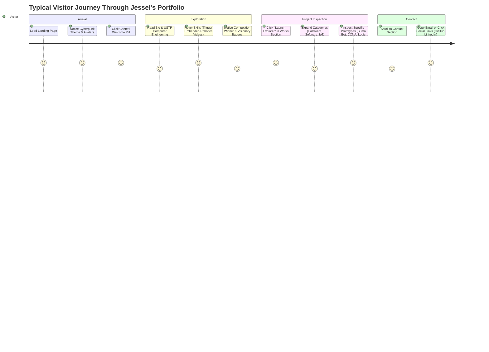

# Portfolio Walkthrough & Architecture Visualization

> **Repository:** `jesselsajulga/Portfolio`  
> **Application Title:** *Jessel's Mini Showroom*  
> **Developer:** Jessel Rome B. Sajulga  
> **Source Base:** Single Page Application (React 19 + Vite 7 + Tailwind CSS v4 + Framer Motion)

---

## 1. Portfolio Overview

### What the Portfolio Is
*Jessel's Mini Showroom* is a single-page interactive web portfolio created by **Jessel Rome B. Sajulga**, a Computer Engineering student/graduate from the **University of Science and Technology of Southern Philippines (USTP)**.

### Overall Purpose & Target Audience
* **Purpose:** To demonstrate technical proficiency across both hardware engineering and software systems. Rather than presenting static lists of bullet points, the portfolio showcases working prototypes, circuits, automated systems, code repositories, and networking certificates.
* **Target Audience:** Engineering recruiters, hardware/firmware hiring managers, software development teams, academic peers, and potential collaborators in robotics, embedded systems, and IoT.

### Main Impression & Identity Communicated
The site projects a **Cyberpunk / Technologist identity**:
* Dark, neon-accented futuristic aesthetics (`#0a0a12`, cyan `#22d3ee`, purple `#a855f7`).
* Strong focus on **tangible prototyping**—bridging abstract software logic with real-world physical machines and electronic circuits.
* Playful and personality-driven interactive elements (e.g., interactive character avatars, confetti triggers, image crossfades, and an IDE-style file tree project explorer).

---

## 2. Design & Visual Direction

### Overall Aesthetic
* **Cyberpunk & Glassmorphism:** Deep space black background (`#0a0a12`) overlaid with high-radius blurred color orbs (cyan, purple, pink), translucent cards (`bg-[#11111a]/80 backdrop-blur-xl`), hairline borders (`border-white/10`), and neon glowing drop-shadows.

### Color Palette & Visual Accents
| Role | Color / Value | Usage in Code |
| :--- | :--- | :--- |
| **Canvas Background** | `#0a0a12` | Root body, page background |
| **Card / Surface Background** | `#11111a` / `rgba(17,17,26,0.8-0.9)` | Floating panels, modals, Explorer containers |
| **Primary Accent (Cyan)** | `#06b6d4` / `#22d3ee` / `cyan-400` | Section headers, active indicators, neon glow shadows, button hover states |
| **Secondary Accent (Purple)** | `#9333ea` / `#a855f7` / `purple-500` | Gradients, decorative blur orbs, secondary tags |
| **Accent Glow / Gradients** | `from-cyan-400 to-purple-500` | Text headings, brand logo, active tab indicator |
| **Card Highlight Gradient** | `from-cyan-600 via-blue-600 to-purple-600` | Connect bar & social media card |
| **Neutral Foreground** | `#ffffff`, `#d1d5db`, `#9ca3af` | High contrast headings and readable body text |

### Typography
* **Primary Cyberpunk Headings / Badges:** `'Orbitron', sans-serif` (imported from Google Fonts as `.font-cyber`).
* **Title & Accents:** System sans-serif with bold tracking (`tracking-widest`), paired with high-impact font weights (`font-bold`, `font-semibold`).
* *(Note: `'Great Vibes'` is imported in CSS but primarily `'Orbitron'` and Tailwind sans are active across UI components).*

### Layout Structure & Navigation
* **Single-Page Scrolling:** Clean vertical flow with fixed top navigation (`<Navbar />`) anchoring direct hash jumps (`#home`, `#about`, `#works`, `#contact`).
* **Active Scroll Spy:** Uses throttled window scroll tracking (100ms via `lodash/throttle`) to highlight the active section in real time.
* **Layout Isolation:** `overflow-x-hidden` on `html, body` and `<App />` ensures horizontal drift and unwanted scrollbars are prevented on all screens.

### Animations, Transitions & Effects
1. **Framer Motion Micro-Interactions:**
   * Spring-based layout transitions (`type: "spring", stiffness: 250, damping: 25`).
   * Subtle floating loops on badges and floating cards (`y: [0, -20, 0]`, rotation oscillations).
   * Directional slide-ins (`whileInView`) triggering when components enter the viewport.
2. **Interactive Avatars:**
   * Top-left avatar pill cycling between Shrek, Face, and Frog upon click.
   * Auto-plays `.webm` video on mouse hover (or click on touch devices) and falls back to static `.webp` image when idle.
3. **Canvas Confetti:**
   * Clicking the `"👋 Welcome to my portfolio"` pill fires dual-cannon confetti bursts across the screen.
4. **Hero Image Crossfade:**
   * Hovering or touching the profile picture crossfades from the primary headshot (`profile.webp`) into a playful alternate portrait (`profilemog.webp`).
5. **Interactive Skill Media Preview:**
   * Hovering over any skill item on desktop swaps out the static bio card with a full-card video or animated showcase of that technical domain.

### Responsive Behavior (Desktop vs. Mobile)
* **Adaptive Navigation:** Full pill menu with animated underline indicator on desktop; compact collapsible hamburger drawer on mobile.
* **Performance Offloading on Mobile:**
   * Heavy 3D-like infinite ambient rotating orbs and particle badges are disabled (`!isMobile`) on screens below 768px or coarse pointers.
   * Blur radius is reduced (e.g., from `blur-[60px]` to `blur-[30px]`) to ensure 60fps rendering on mobile GPUs.
   * Push buttons utilize touch-down states (`activeBtn` via `onTouchStart`/`onTouchEnd`) to emulate desktop hover physics on touchscreens.

---

## 3. Hero / Landing Section

### Visual Breakdown & Layout
* **Position:** First viewport block (`id="home"`, `min-h-screen pt-32 md:pt-40`).
* **Grid Split:** Two-column layout on desktop (`md:grid-cols-2`), stacked vertically on mobile.

```
+-----------------------------------------------------------------------------------+
|  [👋 Welcome to my portfolio] (Confetti trigger)                                  |
|                                                                                   |
|  Yo, Yours truly,                                       [ 🤖 Robotics ]           |
|  Jessel Rome Sajulga                                    +-----------------------+ |
|                                                         |                       | |
|  A promising Computer Engineer from USTP                |  [Profile Image]      | |
|                                                         |  (Crossfade on Hover) | |
|  "Focused on hands-on prototyping, turning abstract    |                       | |
|   ideas into working systems..."                        +-----------------------+ |
|                                                         [ ⚡ Computer Engr. ]     |
|  [ Contact me ]   [ View Projects ]                                               |
|                                                                                   |
|  (GitHub) (Messenger) (LinkedIn) (Instagram)                                      |
+-----------------------------------------------------------------------------------+
```

### Displayed Information
* **Welcome Badge:** Interactive pill with waving hand emoji `👋` triggering celebratory confetti.
* **Name & Headline:** 
  * Large gradient title: **Jessel Rome Sajulga**
  * Subtitle: **"A promising Computer Engineer from USTP"**
* **Mission Statement:**
  > *"Focused on hands-on prototyping, turning abstract ideas into working systems. With a clear focus on robotics, designing and integrating intelligent machines that connect software logic with real-world hardware."*
* **Calls to Action (CTAs):**
  * `Contact me`: Jumps smoothly to `#contact`. Styled with a 3D tactile push effect (`shadow-[0_4px_0_rgb(107,114,128)]` that depresses on click).
  * `View Projects`: Jumps smoothly to `#works` with identical button physics.
* **Social Quick-Links:** Round tactile buttons linking directly to GitHub, Facebook Messenger, LinkedIn, and Instagram.
* **Hero Visual Cards:** Floating profile image container flanked by dual floating status tags:
  * Top-Right: `Bot` icon with **"Robotics"** label.
  * Bottom-Left: `Cpu` icon with **"Computer Engr."** label.

---

## 4. About Me Section

### Structure & Layout
Located at `id="about"`, rendered as a dual-column card system with an integrated bottom contact banner.

```
+-----------------------------------------------------------------------------------+
|                               ABOUT ME                                            |
|                   Get to know more about my journey and passion                   |
|                                                                                   |
|  [💡 Visionary]                                                                   |
|  +--------------------------------+   +----------------------------------------+  |
|  | LEFT: DYNAMIC VIEWPORT         |   | RIGHT: TECHNICAL DOMAIN TILES          |  |
|  |                                |   |                                        |  |
|  | [Default State: Narrative Bio] |   | 1. [Cpu] Embedded Systems              |  |
|  | - Inspiration from logic to    |   |    "Hardware-software integration"     |  |
|  |   machines in the real world   |   |                                        |  |
|  | - Grounding across all layers  |   | 2. [Bot] Robotics                      |  |
|  |                                |   |    "Intelligent machine design"        |  |
|  | [Hover State: Swaps to Media]  |   |                                        |  |
|  | - Full card looping WebM video |   | 3. [Zap] Automation                    |  |
|  |   matching the hovered domain  |   |    "Smart system solutions"            |  |
|  +--------------------------------+   |                                        |  |
|                         [💻 Developer]| 4. [Award] Problem Solving             |  |
|                                       |    "Practical engineering"             |  |
|                                       +----------------------------------------+  |
|                                                                                   |
|  +-----------------------------------------------------------------------------+  |
|  | CONNECT WITH ME  "Let's create something amazing together" [Icons]         |  |
|  +-----------------------------------------------------------------------------+  |
+-----------------------------------------------------------------------------------+
```

### Personal Narrative & Brand
* **Educational Anchor:** Computer Engineering at the University of Science and Technology of Southern Philippines (USTP).
* **Guiding Philosophy:** 
  * Turning abstract mathematical and programmatic logic into machines that physically shape reality.
  * Understanding technology vertically: from circuit level, microprocessors, and assembly up to algorithms and web interfaces.
* **Floating Archetype Badges:** Decorated with floating badges:
  * Top-Left: **"Visionary"** (`Lightbulb` icon, purple theme).
  * Bottom-Right: **"Developer"** (`Code2` icon, cyan theme).

### Interactive Skill Preview Engine
When the user hovers over any skill card on the right, Framer Motion smoothly replaces the text bio on the left with an active media player displaying a demonstration video:
* Hovering **Embedded Systems** $\rightarrow$ Plays `embedded.webm`
* Hovering **Robotics** $\rightarrow$ Plays `robot.webm`
* Hovering **Automation** $\rightarrow$ Plays `automation.webm`
* Hovering **Problem Solving** $\rightarrow$ Plays `problem.webm`

---

## 5. Skills & Technologies

### Technical Skills Visible Across the Repository

| Category | Skills & Tools Explicitly Defined | How It Is Represented in Code |
| :--- | :--- | :--- |
| **Core Engineering Pillars** | Embedded Systems, Robotics, Automation, Practical Problem Solving | Featured prominently as the four main interactive cards in `About.jsx`. |
| **Hardware & Circuit Design** | Circuit Design, Logic Gates, Flip-Flops, 555 Timer IC, Finite State Machines, Breadboard Prototyping, Integrated Circuits (IC) | Demonstrated through physical projects in `Works.jsx` under *"Logic and Circuit Design"*. |
| **Hardware Description & Low-Level** | HDL, Verilog, MIPS Assembly, Computer Architecture | Included in projects *"HDL"* and *"MIPS"*. |
| **Microcontrollers, Electronics & IoT** | Arduino, Ultrasonic Sensors, Capacitors, Transformers, Voltage Regulators, Microprocessors, IoT Systems | Highlighted in the *"Electrical and Electronics"* project suite. |
| **Software & Web Development** | React 19, JavaScript (ES6+), HTML5, CSS3, Tailwind CSS, Vite, Python, REST APIs | Powering the portfolio itself and web apps like *"Calculus Calculator"* & *"Sensory Prediction"*. |
| **Automation & AI Tools** | n8n, AI Agent automation | Showcased in *"n8n Automation"* project. |
| **Networking & Security** | Cisco CCNA, Cybersecurity, pfSense, Tailscale, Active Directory, Windows Server | Featured in *"Security & Networking"* section. |

---

## 6. Projects

The portfolio organizes **20 distinct projects/accomplishments** into **4 specialized categories** inside an IDE-style file explorer component (`<Works />`).

```
Portfolio
├── 📁 Logic and Circuit Design (6 projects)
├── 📁 Software Development (5 projects)
├── 📁 Security & Networking (3 projects)
└── 📁 Electrical and Electronics (6 projects)
```

### Complete Project Inventory

#### Category 1: Logic and Circuit Design (`hw-design`)
| Project Title | Status | Goal / Description | Technologies / Tags | Asset File |
| :--- | :--- | :--- | :--- | :--- |
| **Simple LCD Design** | Completed | Designing and implementing a simple Logic Circuit with Integrated Circuit Logic Gates. | Circuit Design, Logic Gates | `project1.webp` |
| **Anti-Theft Mechanism** | Completed | Using Logic Gates and Flip-Flops to create a functional hardware security system. | Hardware, Memory | `project2.webp` |
| **Christmas Light Controller** | Completed | Designed a circuit that controls the sequencing/blinking of lights using a 555 Timer IC. | Prototyping, 555 Timer IC | `project3.webp` |
| **Alarm System** | Completed | A finite state machine implementation for managing a multi-condition alarm system. | State Machines | `project4.webp` |
| **HDL** | Completed | Hardware description project implementing digital logic lessons using Verilog. | HDL, Verilog | `project11.webp` |
| **Breadboard Competition Champion** | Completed | Competed in a breadboard circuit competition and won 1st place, applying IC and logic gate skills. | IC, Logic Gates, Prototyping, Problem Solving | `competetion.webp` |

#### Category 2: Software Development (`sw-dev`)
| Project Title | Status | Goal / Description | Technologies / Tags | Asset File |
| :--- | :--- | :--- | :--- | :--- |
| **Portfolio Website** | Completed | A personal showcase website built with React, Tailwind CSS, and Framer Motion. | React, TailwindCSS | `project5.webp` |
| **Calculus Calculator** | Completed | Web application designed to solve calculus mathematical problems using APIs and vanilla JS. | HTML, CSS, JavaScript | `project6.webp` |
| **Sensory Prediction** | Completed | A web application that predicts sensory output values given sensory input data. | JavaScript, TailwindCSS, Python | `project7.webp` |
| **n8n Automation** | In Progress | A planned workflow automation extension for Antigravity to automate repetitive syntax typing. | AI, n8n | `project8.webp` |
| **MIPS** | Completed | Deep dive into microprocessor instructions and computer architecture programming using MIPS. | MIPS, Assembly, Computer Architecture | `project9.webp` |

#### Category 3: Security & Networking (`sec-net`)
| Project Title | Status | Goal / Description | Technologies / Tags | Asset File |
| :--- | :--- | :--- | :--- | :--- |
| **CCNA Completion Certificate** | Completed | Cisco Certified Network Associate (CCNA) certification covering networking, IP connectivity, security, and automation. | Python, Cybersecurity | `project10.webp` |
| **Cybersecurity** | Completed | Hands-on ethical hacking/white-hat penetration testing and perimeter firewall deployment. | Cybersecurity, pfSense, Tailscale | `project12.webp` |
| **Network Security** | Completed | Deployment and hardening of Windows Server environments and Active Directory domain services. | Cybersecurity, Active Directory, Windows Server | `project17.webp` |

#### Category 4: Electrical and Electronics (`elec-eng`)
| Project Title | Status | Goal / Description | Technologies / Tags | Asset File |
| :--- | :--- | :--- | :--- | :--- |
| **Automatic Signal Light** | Completed | Automated traffic control signal light prototype utilizing microcontroller logic. | IoT, Microcontrollers | `project19.webp` |
| **Parking Assistance** | Completed | Ultrasonic distance-sensing vehicle parking assistance system built with Arduino. | IoT, Microcontrollers | `project18.webp` |
| **Mini Banking System** | Completed | Embedded hardware/software interface simulating ATM/banking transaction logic. | IoT, Microcontrollers | `project16.webp` |
| **Sumo Bot** | Completed | Autonomous competitive combat robotics platform designed using feedback and control systems principles. | IoT, Microcontrollers | `project15.webp` |
| **Power Supply** | Completed | Stepped-down regulated DC power supply built from discrete transformers, capacitors, and voltage regulators. | Electricals, Electronics | `project14.webp` |
| **ThirstAid!** | Completed | Smart IoT water bottle that monitors hydration and reminds its user to drink every hour. | IOT, Electronics, Microprocessor | `project13.webp` |

---

## 7. Other Sections & Integrations

### Navigation Bar (`<Navbar />`)
* **Interactive Character Box (Avatar):** Positioned to the left of the navbar pill. Features three selectable avatars:
  1. *Shrek* (`shrekStatic` / `shrekMotion`)
  2. *Face* (`faceStatic` / `faceMotion`)
  3. *Frog* (`frogStatic` / `frogMotion`)
  * Displays a glowing indicator `"TAP"`. Clicking advances to the next avatar and triggers its animated video.
* **Branded Title:** `"JESSEL'S MINI SHOWROOM"` styled in glowing cyan-to-purple gradient with `'Orbitron'` typography.
* **Navigation Links:** `Home` (`#home`), `About` (`#about`), `Works` (`#works`), `Contact` (`#contact`).

### Contact Section (`<Contact />`)
* **Anchor:** `id="contact"`.
* **Left Card (Collaboration):**
  * Title: *"Collaboration is the key to Success"*
  * Message: Open to discussing new projects, collaborations, and creative ideas.
  * Direct Email: `sajulga.jessel123@gmail.com` (clickable `mailto:` link with `Mail` icon).
* **Right Card (Social Channels):**
  * Title: *"Connect on Social Media"*
  * Gradient backdrop (`from-cyan-600 via-blue-600 to-purple-600`) with four styled destination cards:
    * **GitHub:** `@jesselsajulga` (`https://github.com/jesselsajulga`)
    * **Messenger:** `@itsmejesselsajulga` (`https://www.facebook.com/itsmejesselsajulga`)
    * **LinkedIn:** `Jessel Rome` (`https://www.linkedin.com/in/jessel-rome-b-sajulga-b22b843a4/`)
    * **Instagram:** `@_jcieee1` (`https://www.instagram.com/_jcieee1/`)

### Footer (`<Footer />`)
* Located at the bottom of the page, styled with a top border line (`border-white/10`).
* Quick-jump links (`Home`, `About`, `Works`, `Contact`).
* Copyright notice: `© 2026 Jessel Rome Sajulga. All rights reserved.`

### Discovered Absences (Explicit Factual Observations)
* **No standalone Education section:** Academic affiliation (USTP) is stated in the Hero and About narrative rather than a separate timetable or schooling card.
* **No standalone Work Experience section:** Engineering background is communicated through projects and competition achievements.
* **No direct Resume/CV download button:** The repository contains no linked PDF resume.

---

## 8. Technical Implementation

### Technologies & Libraries
* **Framework:** React 19 (`react: ^19.2.0`, `react-dom: ^19.2.0`)
* **Bundler & Tooling:** Vite 7 (`vite: ^7.2.4`, `@vitejs/plugin-react: ^5.1.1`)
* **Styling:** Tailwind CSS v4 (`tailwindcss: ^4.1.18`, `@tailwindcss/vite: ^4.1.18`)
* **Motion & Animation:** Framer Motion (`framer-motion: ^12.33.0`)
* **Iconography:** Lucide React (`lucide-react: ^0.563.0`)
* **Utilities:**
  * `canvas-confetti: ^1.9.4` (Confetti visual effects)
  * `lodash/throttle: ^4.17.23` (Scroll performance throttling)

### File & Directory Structure
```
portfolio/
├── index.html                  # HTML5 shell, favicon, Google Fonts (Audiowide, Orbitron)
├── vite.config.js              # Vite configuration with React & Tailwind plugins
├── package.json                # Dependencies, scripts (dev, build, lint, preview)
├── eslint.config.js            # Flat ESLint configuration (custom rule for motion JSX)
├── README.md                   # Project overview and installation guide
└── src/
    ├── main.jsx                # React root mount (StrictMode + App)
    ├── App.jsx                 # Master page assembler and layout wrapper
    ├── App.css                 # Local component styles
    ├── index.css               # Global CSS, Google Font @imports, Tailwind directive
    ├── assets/                 # 34 media assets (.webp images & .webm videos)
    └── components/
        ├── Navbar.jsx          # Top navigation bar, scroll spy, character avatar switcher
        ├── Hero.jsx            # Landing hero, confetti button, profile image crossfade
        ├── About.jsx           # Bio narrative, video-swapping skill preview, connect bar
        ├── Works.jsx           # VSCode-style interactive directory tree project explorer
        ├── Contact.jsx         # Direct email CTA & social channel grid
        └── Footer.jsx          # Bottom copyright & secondary navigation links
```

### Key Component Architectures
1. **Interactive File Explorer (`Works.jsx`):**
   * Uses state-driven progressive disclosure:
     * `INIT`: Displays a terminal launcher button (`"Launch Explorer"`).
     * `OPENED`: Expands to a multi-column IDE layout showing root folders.
     * `EXPANDED`: Reveals categorized project sub-directories.
   * `activeProject` manages which project is loaded into the right-hand dynamic preview stage.
2. **Dynamic Skill Viewport (`About.jsx`):**
   * Employs `<AnimatePresence mode="wait">` to crossfade between the text bio and the rich video demonstration corresponding to the active `hoveredSkill`.
3. **Scroll Spy (`Navbar.jsx`):**
   * Calculates `window.scrollY + 200` and compares it against section DOM bounds (`offsetTop` and `offsetHeight`) inside a throttled callback to update `activeTab` with zero jitter.

---

## 9. Visitor Journey



1. **Arrival & Hero (`#home`):**
   * Visitor lands on a dark cyberpunk canvas.
   * Sees the headline: *"Jessel Rome Sajulga — A promising Computer Engineer from USTP"*.
   * Engages with interactive elements: clicks the avatar in the navbar or triggers confetti on the welcome pill.
   * Notices floating badges indicating dual expertise in **Robotics** and **Computer Engineering**.
2. **Deep Dive into Identity (`#about`):**
   * Learns about the developer’s passion for bridging abstract logic with hardware machines.
   * Hovers over the four skill pillars (**Embedded Systems**, **Robotics**, **Automation**, **Problem Solving**) to see live demonstration clips playing in real-time.
3. **Project Discovery (`#works`):**
   * Arrives at the **Project Explorer**. Clicks `"Launch Explorer"` to expand the simulated IDE.
   * Browses through 4 directories containing 20 projects, ranging from competitive robotics (*Sumo Bot*, *Breadboard Competition Champion*) to digital logic (*HDL/Verilog*, *Flip-Flops*), networking (*CCNA*, *pfSense*), and software (*Calculus Calculator*, *Automation*).
   * Clicks/hovers items to inspect high-resolution imagery, descriptions, and technology tags in the preview viewport.
4. **Outreach & Connection (`#contact`):**
   * Reaches the contact portal.
   * Finds a direct email link (`sajulga.jessel123@gmail.com`) alongside instant links to GitHub, LinkedIn, Messenger, and Instagram.

---

## 10. Portfolio Visualization

```text
========================================================================================
                          JESSEL'S MINI SHOWROOM (PORTFOLIO)
========================================================================================
│
├── [NAVBAR] (Sticky Top)
│   ├── Character Avatar Switcher [Shrek ➔ Face ➔ Frog] (WebM / WebP)
│   ├── Logo: "JESSEL'S MINI SHOWROOM" (.font-cyber)
│   └── Navigation Links [Home | About | Works | Contact] + Mobile Drawer
│
├── [HERO / LANDING] (#home)
│   ├── Interactive Welcome Badge [👋 Confetti Trigger]
│   ├── Identity: "Jessel Rome Sajulga" (USTP Computer Engineer)
│   ├── Tagline: Prototyping, robotics, connecting software logic with hardware
│   ├── Primary CTAs: [Contact me] | [View Projects] (3D Tactile Buttons)
│   ├── Quick Socials: [GitHub] [Messenger] [LinkedIn] [Instagram]
│   └── Visual Stage: Floating Card + Profile Crossfade + [Robotics] [Computer Engr.] Badges
│
├── [ABOUT ME] (#about)
│   ├── Section Header: "About Me"
│   ├── Floating Badges: [💡 Visionary] [💻 Developer]
│   ├── Dynamic Stage (Two-Column):
│   │   ├── Left Column: Narrative Bio ➔ Crossfades to Video Preview on Skill Hover
│   │   └── Right Column: 4 Core Pillars [Embedded Systems | Robotics | Automation | Problem Solving]
│   └── Connect Bar: Gradient Banner + Direct Social Icons
│
├── [PROJECT EXPLORER] (#works)
│   ├── Section Header: "Project Explorer"
│   └── IDE-Style Window Layout:
│       ├── Terminal Launcher: [ >_ Launch Explorer ]
│       ├── Left Tree: Categorized File System:
│       │   ├── 📁 Logic and Circuit Design (6 items)
│       │   │   ├── Simple LCD Design
│       │   │   ├── Anti-Theft Mechanism
│       │   │   ├── Christmas Light Controller
│       │   │   ├── Alarm System
│       │   │   ├── HDL
│       │   │   └── Breadboard Competition Champion 🏆
│       │   ├── 📁 Software Development (5 items)
│       │   │   ├── Portfolio Website
│       │   │   ├── Calculus Calculator
│       │   │   ├── Sensory Prediction
│       │   │   ├── n8n Automation
│       │   │   └── MIPS
│       │   ├── 📁 Security & Networking (3 items)
│       │   │   ├── CCNA Completion Certificate 📜
│       │   │   ├── Cybersecurity
│       │   │   └── Network Security
│       │   └── 📁 Electrical and Electronics (6 items)
│       │       ├── Automatic Signal Light
│       │       ├── Parking Assistance
│       │       ├── Mini Banking System
│       │       ├── Sumo Bot
│       │       ├── Power Supply
│       │       └── ThirstAid!
│       └── Right Stage: Dynamic Project Preview (Screenshot, Title, Status, Description, Tech Badges)
│
├── [CONTACT] (#contact)
│   ├── Section Header: "Get In Touch"
│   ├── Left Card: Collaboration Callout + Email (sajulga.jessel123@gmail.com)
│   └── Right Card: Vibrant Social Media Grid (GitHub, Messenger, LinkedIn, Instagram)
│
└── [FOOTER]
    ├── Quick Links: [Home | About | Works | Contact]
    └── Copyright: © 2026 Jessel Rome Sajulga. All rights reserved.
========================================================================================
```

---

## 11. Overall Portfolio Assessment

### Factual Strengths
1. **Compelling Hardware & Engineering Specialization:**
   * Unlike generic web development portfolios that only show to-do apps, this portfolio demonstrates genuine breadth in computer engineering: breadboard circuit design, 555 timers, Verilog HDL, microprocessors, sumo robotics, and networking.
2. **Cohesive Futuristic Theme:**
   * Consistent visual identity with a `#0a0a12` dark palette, cybernetic typography, and sleek glow effects that fit the computer engineering / robotics theme.
3. **Memorable & Gamified Interactive Elements:**
   * Features like the interactive character avatar in the navbar, confetti on click, and video previews upon hovering skills leave a strong, memorable impression.
4. **Clever Project Organization:**
   * The IDE/folder tree explorer in `<Works />` neatly organizes 20 projects into distinct categories without overwhelming the visitor with an endless vertical list.

### Factual Observations & Potential Areas for Enhancement
1. **Absence of External Project Links:**
   * Projects in `Works.jsx` contain screenshots, descriptions, and technology tags, but do not provide live demo URLs or links to GitHub repositories for individual projects.
2. **Portfolio Folder Count Mismatch:**
   * In `Works.jsx` line 169, the directory label displays `"(10 projects)"`, while the category lists actually contain 20 total projects.
3. **Resume / CV Accessibility:**
   * There is no direct button or link to download a formal resume/CV PDF, which recruiters often look for.
4. **Mobile Project Selection Interaction:**
   * On mobile devices, browsing the project tree can require extra scrolling between the folder directory and the preview panel below it.
